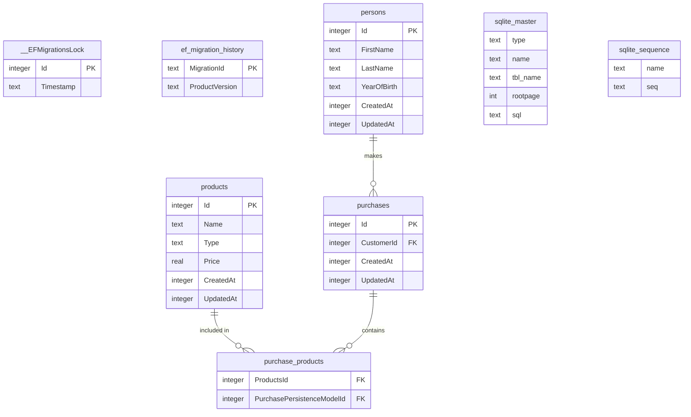

# Backend Test API

A small CRUD API for people, products, and their purchases, with a CSV purchase report
endpoint. Originally a take-home exercise; refactored into a layered .NET 10 solution
with EF Core/SQLite, FluentValidation, and integration tests (see `EVALUATION_PREP.md`
for the full refactoring narrative).

---

## Quick Start

**Prerequisites:** [.NET 10 SDK](https://dotnet.microsoft.com/download/dotnet/10.0) · [Docker Desktop](https://www.docker.com/products/docker-desktop/) (optional)

```bash
# 1. Clone
git clone <repo-url> && cd Backend-Test

# 2. Start the API
docker compose up --build -d

# API  → http://localhost:8080
# Docs → http://localhost:8080/scalar/v1
```

No database container is needed — the API uses an embedded SQLite database, seeded
with sample data automatically on first startup via EF Core migrations.

---

## Setup — without Docker

```bash
dotnet run --project src/BackendTest.Host

# API  → http://localhost:5151
# Docs → http://localhost:5151/scalar/v1
```

`launchSettings.json` points `ConnectionStrings__Sqlite` at a local `database.db` file
(created next to the project) and sets `ASPNETCORE_ENVIRONMENT=Development`. Migrations
apply and seed data automatically on startup — no separate `dotnet ef database update`
step is required.

---

## Architecture

```
src/
├── BackendTest.Host           # Controllers, request/response DTOs, validators, mappers
├── BackendTest.Application    # IEntityService<T>, application models, per-entity services
└── BackendTest.Infrastructure # EF Core DbContext, SQLite, migrations, persistence models

test/
└── BackendTest.Integration.Tests # Full HTTP + SQLite, one temp-file DB per test class
```

Project references form a straight chain: `Host → Application → Infrastructure`. A
generic `EntityService<TPersistence, TApplication>` implements `GetAll`/`Get`/`Insert`/
`Update`/`Delete` once via injected mapping delegates; `PurchaseService` overrides
`Insert`/`Update` because a purchase attaches *existing* `Person`/`Product` rows by id
rather than inserting new ones.

# Database Schema


---

## API Endpoints

All entity endpoints are versioned (`api/v1/...`); the diagnostic `environment`
endpoints are not.

| Method   | Path                                | Description                          |
|----------|--------------------------------------|---------------------------------------|
| `GET`    | `/api/v1/persons/getall`             | List all persons                     |
| `GET`    | `/api/v1/persons/get/{id}`           | Get a person by id                   |
| `POST`   | `/api/v1/persons/add`                | Create a person                      |
| `POST`   | `/api/v1/persons/update/{id}`        | Update a person                      |
| `DELETE` | `/api/v1/persons/delete/{id}`        | Delete a person                      |
| `GET`    | `/api/v1/products/getall`            | List all products                    |
| `GET`    | `/api/v1/products/get/{id}`          | Get a product by id                  |
| `POST`   | `/api/v1/products/add`               | Create a product                     |
| `POST`   | `/api/v1/products/update/{id}`       | Update a product                     |
| `DELETE` | `/api/v1/products/delete/{id}`       | Delete a product                     |
| `GET`    | `/api/v1/purchases/getall`           | List all purchases                   |
| `GET`    | `/api/v1/purchases/get/{id}`         | Get a purchase by id                 |
| `GET`    | `/api/v1/purchases/get/{id}/report`  | Download a CSV purchase report       |
| `POST`   | `/api/v1/purchases/add`              | Create a purchase                    |
| `POST`   | `/api/v1/purchases/update/{id}`      | Update a purchase                    |
| `DELETE` | `/api/v1/purchases/delete/{id}`      | Delete a purchase                    |
| `GET`    | `/environment/isproduction`          | Diagnostic: is this a production env |
| `GET`    | `/environment/apiversion`            | Diagnostic: configured API version   |

**Add request bodies** (no `id` — it's generated on insert):
```json
// POST /api/v1/persons/add
{ "firstName": "John", "lastName": "Doe", "yearOfBirth": "1990-01-01" }

// POST /api/v1/products/add
{ "name": "Pipe Wrench", "type": "Plumbing", "price": 19.99 }

// POST /api/v1/purchases/add
{ "customerId": 1, "productIds": [1, 3, 4] }
```

**Update request bodies** carry the same fields plus `id`, which must match the `{id}`
route segment.

**CSV report** (`GET /api/v1/purchases/get/{id}/report`):
```csv
CustomerName:;John Doe
ProductId;Count;ProductName;Price
1;1;Pipe Wrench;19,99
3;2;Garden Hose;4,99
4;1;Toilet Plunger;1,49
```

**HTTP status codes:** `201` created · `200` ok · `400` validation error · `404` not found · `500` unexpected error

---

## Running Tests

```bash
dotnet test test/BackendTest.Integration.Tests
```

Each test class gets its own temp-file SQLite database (migrated and seeded on boot,
deleted on teardown), so no external services or setup are required.

---

## Configuration

The connection string and validation options are supplied via environment variables,
not checked into `appsettings.json`:

```bash
ConnectionStrings__Sqlite="Data Source=database.db"
Validation__Person__MinimumAge=18
```

`Validation:Person:MinimumAge` is bound to `PersonValidationOptions` with
`ValidateOnStart()`, so a missing or invalid value fails fast at boot rather than on
the first request.

---

## Assumptions

1. **SQLite as the datastore.** No external database service is required; the schema
   is created and seeded by EF Core migrations on startup (`context.Database.MigrateAsync()`
   in `Program.cs`).
2. **Auto-generated ids.** `Add` requests (`PersonAddRequest`/`ProductAddRequest`/
   `PurchaseAddRequest`) never carry an `id` — the database assigns it on insert.
   `Update` requests carry `id` and it must match the route segment.
3. **Configurable minimum age.** `Validation:Person:MinimumAge` (default `18` in
   development) is enforced by `PersonRequestValidator`/`PersonAddRequestValidator`
   via a config-bound `IOptionsMonitor<PersonValidationOptions>`.
4. **Purchases reference existing rows, not new ones.** `customerId`/`productIds`
   must already exist; an unknown id is rejected by the database's foreign-key
   constraint (`DbUpdateException`), not a pre-check `SELECT`.
5. **No authentication** — out of scope for this exercise.
6. **The Docker image runs as a non-root user**, so the SQLite file is placed under
   `/tmp` (world-writable) rather than `/app`; each container start gets a fresh,
   freshly-seeded database.
